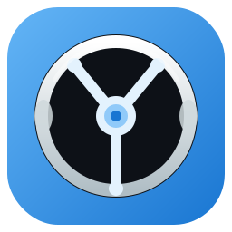

<p align="center">
  
</p>

## DriveDroid

[](./LICENSE)
[](https://github.com/uzairdeveloper223/DriveDroid)
[](https://github.com/uzairdeveloper223/DriveDroid/actions/workflows/release.yml)
[](https://github.com/uzairdeveloper223/DriveDroid/releases)
[](https://developer.android.com/)
[](https://kotlinlang.org/)

DriveDroid turn your Android phone into a simple, low‑latency steering wheel and pedal controller for your PC racing games.  
The app connects to a small WebSocket server on your Linux machine and sends steering, acceleration, braking and handbrake commands in real time.

### What you get

- **Motion steering**: Hold your phone like a steering wheel. You can tweak sensitivity and deadzone from the in‑app settings.
- **Touch mode**: If you do not want motion, there are big left/right, race, brake and handbrake buttons on the screen.
- **Keyboard mapping**: I map everything to common keys (W/S or arrows) so you can plug this into almost any PC racing game.
- **Optional gamepad steering**: If your game supports analog steering axes, the server can expose a virtual gamepad and DriveDroid will send analog steering values.
- **Saved settings**: I store your control mode and steering configuration with DataStore so you do not have to re‑configure every time.

### How to set it up

Most people will not need to build anything.  
You can just grab the latest APK and server ZIP from the **[Releases page](https://github.com/uzairdeveloper223/DriveDroid/releases)** and start using it.

If you prefer to build or hack on the code yourself, the steps below explain how.

1. **Set up the PC server (Linux)**

Inside the `server/` folder I provide a small Python WebSocket server that receives commands from the app and sends real keyboard and gamepad events to your game using `uinput` and `websockets`.

The easiest way to start it is with the helper script that is included in the server ZIP and in this repo:

```bash
cd server
chmod +x run_server.sh
./run_server.sh
```

The script will:

- Create `venv/` if it does not exist.
- Install Python dependencies from `requirements.txt`.
- Try to install `wmctrl` (needed for optional window targeting).

Depending on your system, you may still need to run it with `sudo` or adjust your `uinput` permissions.

If you prefer to do everything by hand, you can follow these steps instead:

```bash
cd server
python3 -m venv venv
source venv/bin/activate
pip install -r requirements.txt
sudo venv/bin/python server.py
```

When the server starts, it prints the IP and port it is listening on and shows a list of windows (via `wmctrl`) so you can pick the game window that should receive input.

2. **Install the Android app and connect**

- Install the `DriveDroid-<version>.apk` from the Releases page on your Android device.
- Make sure the Python server is running and note the printed IP address and port (default `8765`).
- On your phone, open DriveDroid and enter the same IP and port.
- Tap **CONNECT**.

After you are connected, open the **Settings** button in the top right of the app and choose whether you want **Motion** or **Touch** controls and which key layout your game uses.

### Releases

I also publish ready‑to‑use builds on GitHub Releases.  
For a tag like `v1.0.0`, the CI workflow builds:

- **Android APK**: `DriveDroid-v1.0.0.apk`
- **Server bundle**: `DriveDroidServer-v1.0.0.zip` (includes `server.py`, `requirements.txt`, and `run_server.sh`)

If you just want to use the project without touching the code, this is the easiest path:

```bash
unzip DriveDroidServer-v1.0.0.zip
cd server
chmod +x run_server.sh
./run_server.sh
```

### WebSocket protocol (what the app sends)

If you want to integrate this with your own tooling or just see what is going over the wire, this is the shape of the messages the app sends:

- **Pedals / buttons**
  - `{"action": "ACCELERATE_W", "state": "DOWN"}`
  - `{"action": "ACCELERATE_W", "state": "UP"}`
  - `{"action": "BRAKE_S", "state": "DOWN"}`
- **Steering (analog gamepad mode)**
  - `{"action": "STEER", "value": -1.0}` (full left)
  - `{"action": "STEER", "value": 0.0}` (center)
  - `{"action": "STEER", "value": 1.0}` (full right)

You can adapt another server implementation to translate these into whatever your game or system needs.

### Project links

- **Repository**: `https://github.com/uzairdeveloper223/DriveDroid`
- **Author GitHub**: `https://github.com/uzairdeveloper223`
- **Portfolio**: `https://uzair.is-a.dev`

### About me

Hi, I am Uzair. I built this because I wanted a simple way to use my phone as a steering wheel and pedal setup for PC games without buying extra hardware.

- **GitHub**: [@uzairdeveloper223](https://github.com/uzairdeveloper223)  
- **Portfolio**: [uzair.is-a.dev](https://uzair.is-a.dev)

If this project helps you or you just like it and want to support my work, you can donate here (includes all my crypto addresses):

- `https://donate.uzair.ct.ws`

### License

This project is licensed under the **MIT License**.  
See [`LICENSE`](./LICENSE) for full details.

